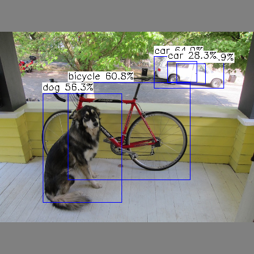
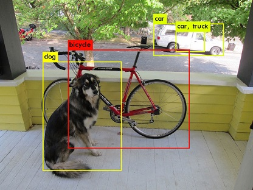

# darknet2ncnn

# 简介

darknet2ncnn将darknet 模型转换为ncnn模型，实现darknet网络模型在移动端的快速部署

[码云](https://gitee.com/damone/darknet2ncnn) : https://gitee.com/damone/darknet2ncnn
1. 除 local/xor conv, rnn, lstm, gru, crnn及iseg外，均提供支持
1. 自定义添加了所有ncnn不直接支持的activation操作，实现位于层DarknetActivation
1. 自定义添加了shortcut层的实现，实现位于层DarknetShortCut
1. 自定义添加了yolo层及detection层的实现，支持YOLOV1及YOLOV3
1. 提供了转换后的模型校验工具，convert_verify,支持检验每一层网络的计算输出，支持卷积层参数检查，方便快速定位模型转换中出现的问题


# 安装及使用

1. Install opencv-dev, gcc, g++, make, cmake

2. 下载源码
```sh
git clone https://github.com/xiangweizeng/darknet2ncnn.git
```
3. 初始化 submodule
```sh
cd darknet2ncnn
git submodule init
git submodule update
```
4. 构建 darknet
```sh
cd darknet2
make -j8
rm libdarknet.so
```
5. 构建 ncnn
```sh
# workspace darknet2ncnn
cd ncnn
mkdir build
cd build
cmake ..
make -j8
make install
cd ../../
```
6. 构建 darknet2ncnn , convert_verify and libdarknet2ncnn.a
```sh
# workspace darknet2ncnn
make -j8
```
7. 模型转换及验证
- Cifar
```sh
# workspace darknet2ncnn
make cifar
./darknet2ncnn data/cifar.cfg  data/cifar.backup example/zoo/cifar.param  example/zoo/cifar.bin 
layer     filters    size              input                output
    0 conv    128  3 x 3 / 1    28 x  28 x   3   ->    28 x  28 x 128  0.005 BFLOPs
    1 conv    128  3 x 3 / 1    28 x  28 x 128   ->    28 x  28 x 128  0.231 BFLOPs
.
.
.
   13 dropout       p = 0.50               25088  ->  25088
   14 conv     10  1 x 1 / 1     7 x   7 x 512   ->     7 x   7 x  10  0.001 BFLOPs
   15 avg                        7 x   7 x  10   ->    10
   16 softmax                                          10
Loading weights from data/cifar.backup...Done!
./convert_verify data/cifar.cfg  data/cifar.backup example/zoo/cifar.param  example/zoo/cifar.bin  example/data/21263_ship.png
layer     filters    size              input                output
    0 conv    128  3 x 3 / 1    28 x  28 x   3   ->    28 x  28 x 128  0.005 BFLOPs
    1 conv    128  3 x 3 / 1    28 x  28 x 128   ->    28 x  28 x 128  0.231 BFLOPs
.
.
.
   13 dropout       p = 0.50               25088  ->  25088
   14 conv     10  1 x 1 / 1     7 x   7 x 512   ->     7 x   7 x  10  0.001 BFLOPs
   15 avg                        7 x   7 x  10   ->    10
   16 softmax                                          10
Loading weights from data/cifar.backup...Done!

Start run all operation:
conv_0 : weights diff : 0.000000
conv_0_batch_norm : slope diff : 0.000000
conv_0_batch_norm : mean diff : 0.000000
conv_0_batch_norm : variance diff : 0.000000
conv_0_batch_norm : biases diff : 0.000000
Layer: 0, Blob : conv_0_activation, Total Diff 595.703918 Avg Diff: 0.005936
.
.
.
Layer: 14, Blob : conv_14_activation, Total Diff 35.058342 Avg Diff: 0.071548
Layer: 15, Blob : gloabl_avg_pool_15, Total Diff 0.235242 Avg Diff: 0.023524
Layer: 16, Blob : softmax_16, Total Diff 0.000001 Avg Diff: 0.000000

```

- Yolov3-tiny
```sh
 make yolov3-tiny.net 
./darknet2ncnn data/yolov3-tiny.cfg  data/yolov3-tiny.weights example/zoo/yolov3-tiny.param  example/zoo/yolov3-tiny.bin 
layer     filters    size              input                output
    0 conv     16  3 x 3 / 1   416 x 416 x   3   ->   416 x 416 x  16  0.150 BFLOPs
.
.
.
   22 conv    255  1 x 1 / 1    26 x  26 x 256   ->    26 x  26 x 255  0.088 BFLOPs
   23 yolo
Loading weights from data/yolov3-tiny.weights...Done!
./convert_verify data/yolov3-tiny.cfg  data/yolov3-tiny.weights example/zoo/yolov3-tiny.param  example/zoo/yolov3-tiny.bin example/data/dog.jpg
layer     filters    size              input                output
    0 conv     16  3 x 3 / 1   416 x 416 x   3   ->   416 x 416 x  16  0.150 BFLOPs
    1 max          2 x 2 / 2   416 x 416 x  16   ->   208 x 208 x  16
.
.
.
   20 route  19 8
   21 conv    256  3 x 3 / 1    26 x  26 x 384   ->    26 x  26 x 256  1.196 BFLOPs
   22 conv    255  1 x 1 / 1    26 x  26 x 256   ->    26 x  26 x 255  0.088 BFLOPs
   23 yolo
Loading weights from data/yolov3-tiny.weights...Done!

Start run all operation:
conv_0 : weights diff : 0.000000
conv_0_batch_norm : slope diff : 0.000000
conv_0_batch_norm : mean diff : 0.000000
conv_0_batch_norm : variance diff : 0.000000
conv_0_batch_norm : biases diff : 0.000000
.
.
.
conv_22 : weights diff : 0.000000
conv_22 : biases diff : 0.000000
Layer: 22, Blob : conv_22_activation, Total Diff 29411.240234 Avg Diff: 0.170619
```
8. 构建 example
```sh
# workspace darknet2ncnn
cd example
make -j2
```
10. 运行 classifier
```sh
# workspace example
make cifar.cifar
./classifier zoo/cifar.param  zoo/cifar.bin  data/32516_dog.png data/cifar_lable.txt
4    deer                             = 0.263103
6    frog                             = 0.224274
5    dog                              = 0.191360
3    cat                              = 0.180164
2    bird                             = 0.094251
```
11. 运行 Yolo

- Run YoloV3-tiny
```sh
# workspace example
 make yolov3-tiny.coco
 ./yolo zoo/yolov3-tiny.param  zoo/yolov3-tiny.bin  data/dog.jpg  data/coco.names
3  [car             ] = 0.64929 at 252.10 92.13 114.88 x 52.98
2  [bicycle         ] = 0.60786 at 111.18 134.81 201.40 x 160.01
17 [dog             ] = 0.56338 at 69.91 152.89 130.30 x 179.04
8  [truck           ] = 0.54883 at 288.70 103.80 47.98 x 34.17
3  [car             ] = 0.28332 at 274.47 100.36 48.90 x 35.03
```

- YoloV3-tiny figure

NCNN:



DARKNET:




12. 构建 benchmark
```sh
# workspace darknet2ncnn
cd benchmark
make 
```
13. 运行 benchmark
- Firefly RK3399 thread2
```
firefly@firefly:~/project/darknet2ncnn/benchmark$ ./benchdarknet 10  2 &
[1] 4556
loop_count = 10
num_threads = 2
powersave = 0
firefly@firefly:~/project/darknet2ncnn/benchmark$ taskset -pc 4,5 4556
pid 4556's current affinity list: 0-5
pid 4556's new affinity list: 4,5         
           cifar  min =   85.09  max =   89.15  avg =   85.81
         alexnet  min =  218.38  max =  220.96  avg =  218.88
         darknet  min =   88.38  max =   88.95  avg =   88.63
       darknet19  min =  330.55  max =  337.12  avg =  333.64
       darknet53  min =  874.69  max =  920.99  avg =  897.19
     densenet201  min =  678.99  max =  684.97  avg =  681.38
      extraction  min =  332.78  max =  340.54  avg =  334.98
        resnet18  min =  238.93  max =  245.66  avg =  240.32
        resnet34  min =  398.92  max =  404.93  avg =  402.18
        resnet50  min =  545.39  max =  558.67  avg =  551.90
       resnet101  min =  948.88  max =  960.51  avg =  952.99
       resnet152  min = 1350.78  max = 1373.51  avg = 1363.40
       resnext50  min =  660.55  max =  698.07  avg =  669.49
resnext101-32x4d  min = 1219.80  max = 1232.07  avg = 1227.58
resnext152-32x4d  min = 1788.03  max = 1798.79  avg = 1795.48
          vgg-16  min =  883.33  max =  903.98  avg =  895.03
     yolov1-tiny  min =  222.40  max =  227.51  avg =  224.67
     yolov2-tiny  min =  250.54  max =  259.84  avg =  252.38
     yolov3-tiny  min =  240.80  max =  249.98  avg =  245.08

```
- Firefly RK3399 thread4
```
firefly@firefly:~/project/darknet2ncnn/benchmark$ ./benchdarknet 10  4 &
[1] 4663 
loop_count = 10
num_threads = 4
powersave = 0
firefly@firefly:~/project/darknet2ncnn/benchmark$ taskset -pc 0-3 4663
pid 4663's current affinity list: 0-5
pid 4663's new affinity list: 0-3        
           cifar  min =   96.51  max =  108.22  avg =  100.60
         alexnet  min =  411.38  max =  432.00  avg =  420.11
         darknet  min =  101.89  max =  119.73  avg =  106.46
       darknet19  min =  421.46  max =  453.59  avg =  433.74
       darknet53  min = 1375.30  max = 1492.79  avg = 1406.82
     densenet201  min = 1154.26  max = 1343.53  avg = 1218.28
      extraction  min =  399.31  max =  460.01  avg =  428.17
        resnet18  min =  317.70  max =  376.89  avg =  338.93
        resnet34  min =  567.30  max =  604.44  avg =  580.65
        resnet50  min =  838.94  max =  978.21  avg =  925.14
       resnet101  min = 1562.60  max = 1736.91  avg = 1642.27
       resnet152  min = 2250.32  max = 2394.38  avg = 2311.42
       resnext50  min =  993.34  max = 1210.04  avg = 1093.05
resnext101-32x4d  min = 2207.74  max = 2366.66  avg = 2281.82
resnext152-32x4d  min = 3139.89  max = 3372.58  avg = 3282.99
          vgg-16  min = 1259.17  max = 1359.55  avg = 1300.04
     yolov1-tiny  min =  272.31  max =  330.71  avg =  295.98
     yolov2-tiny  min =  314.25  max =  352.12  avg =  329.02
     yolov3-tiny  min =  300.28  max =  349.13  avg =  322.54
```

# 支持的网络模型(Zoo)

[Zoo（百度云）：](https://pan.baidu.com/s/1BgqL8p1yB4gRPrxAK73omw):https://pan.baidu.com/s/1BgqL8p1yB4gRPrxAK73omw

## Cifar
1. cifar

## ImageNet
1. alexnet 
2. darknet
3. darknet19
4. darknet53
5. densenet201
6. extraction
7. resnet18
8. resnet34
9. resnet50
10. resnet101
11. resnet152
12. resnext50
13. resnext101-32x4d
14. resnext152-32x4d
15. vgg-16

## YOLO
1. yolov1-tiny
2. yolov2-tiny
3. yolov2
4. yolov3-tiny
5. yolov3
6. yolov3-spp

# 性能评估

时间单位： ms

Network | i7-7700K 4.20GHz 8thread | IMX6Q,Topeet 4thead | Firefly rk3399 2thread | Firefly rk3399 4thread
---------|----------|---------|---------|---------
cifar | 62 | 302 | 85 | 100
alexnet | 92 | 649 | 218 | 420
darknet | 28 | 297 | 88 | 106
darknet19 | 202 | 1218 | 333 | 433
darknet53 | 683 | 3235 | 897 | 1406
densenet201 |218  | 2647 | 681 | 1218
extraction | 244 | 1226 | 334 | 428
resnet18 | 174 | 764 | 240 | 338
resnet34 | 311 | 1408 | 402 | 580
resnet50 | 276 | 2092 | 551 | 925
resnet101 | 492 | 3758 | 952 | 1642
resnet152 | 704 | 5500 | 1363 | 2311
resnext50 | 169 | 2595  | 669  | 1093
resnext101-32x4d | 5274 | 15334 | 1227 | 2281
resnext152-32x4d | 7818 | 22843 | 1795 | 3282
vgg-16 | 884 | 3597 | 895 | 1300
yolov1-tiny| 98 | 843 | 224 | 295
yolov2-tiny| 155 | 987 | 252 | 329
yolov2| 1846 | Out of memofy| Out of memofy | Out of memofy
yolov3-tiny| 159 | 951 | 245 | 322
yolov3| 5198 | Out of memofy| Out of memofy | Out of memofy
yolov3-spp| 5702 | Out of memofy | Out of memofy | Out of memofy